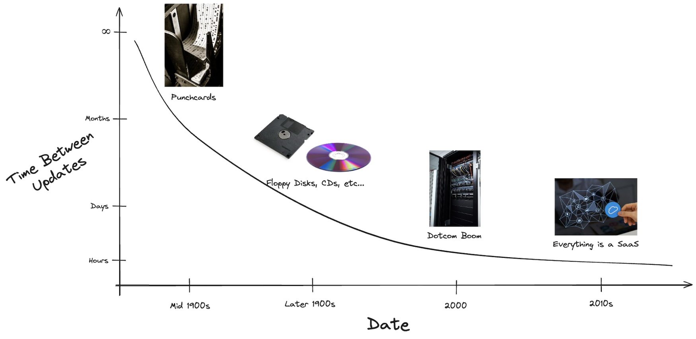
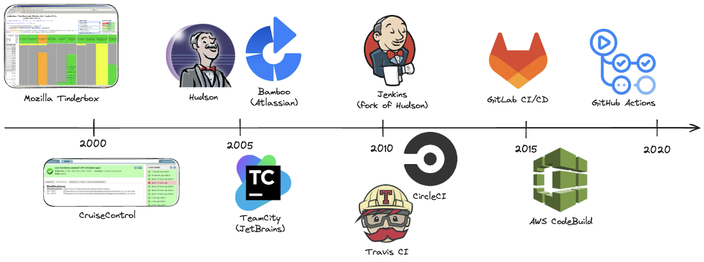

# 13. History and Motivation

> How software delivery evolved from slow, manual, error-prone releases into the automated pipelines teams rely on today — and why Continuous Integration exists in the first place.

## Table of Contents

- [Why CI Exists](#why-ci-exists)
- [Speed of Software Delivery over Time](#speed-of-software-delivery-over-time)
- [History of CI Systems](#history-of-ci-systems)
- [Key Takeaways](#key-takeaways)

## Why CI Exists

Before Continuous Integration became standard practice, merging and shipping code was a slow, high-risk event rather than a routine one. A few recurring pains drove the industry toward automation:

- **Integration hell** — Developers worked in isolation for days or weeks before merging. Combining everyone's changes at once produced a tangle of conflicts that could take days to untangle.
- **"Works on my machine"** — Without a standardized, automated build process, code that ran fine locally would break in another environment, and no one found out until it was too late.
- **Slow feedback loops** — Bugs were often discovered long after the code that caused them was written, making them far more expensive and time-consuming to fix.
- **Manual, error-prone releases** — Deployments relied on checklists and human judgment, so the same class of mistake could resurface release after release.

CI addresses these problems directly: every change is built, tested, and validated automatically the moment it's committed. Feedback that once took days now takes minutes, and integration becomes a routine, low-risk event instead of a dreaded one. This shift is what made the delivery speeds below possible.

## Speed of Software Delivery over Time

The time between writing and shipping software has shrunk drastically over the decades:

| Era              | Delivery Method              | Turnaround Time         |
|-------------------|-------------------------------|--------------------------|
| 🧮 1960s–70s       | **Punch cards / Mainframes**  | Days to weeks            |
| 💾 1980s–90s       | **Floppy disks, CDs**         | Weeks to months          |
| 🌐 2000s           | **Server deployments**        | Daily to weekly          |
| ☁️ 2010s–Now       | **CI/CD pipelines & cloud**   | Multiple times per day   |

## History of CI Systems

| Year | CI Tool            | Significance |
|------|---------------------|---------------|
| 1997 | **Tinderbox**        | Mozilla's early build tracker — one of the first CI-like systems. |
| 2001 | **CruiseControl**    | First widely adopted open-source CI server. |
| 2004 | **Hudson**           | Friendly UI and plugin support for Java CI; widely adopted. |
| 2006 | **TeamCity**         | JetBrains' commercial CI with strong IDE and test integration. |
| 2007 | **Bamboo**           | Atlassian's CI/CD tool with tight Jira/Bitbucket integration. |
| 2011 | **Jenkins**          | Community-driven fork of Hudson; became the CI standard for years. |
| 2011 | **Travis CI**        | First GitHub-native CI/CD as a service. |
| 2011 | **CircleCI**         | Cloud CI/CD with fast feedback and Docker-native builds. |
| 2015 | **GitLab CI/CD**     | Built-in CI/CD pipelines in GitLab, configured via YAML. |
| 2016 | **AWS CodeBuild**    | Managed CI inside the AWS ecosystem. |
| 2018 | **GitHub Actions**   | GitHub-native automation with a deep ecosystem and community support. |

> **Note:** Tooling wasn't the only driver of change. The rise of containerization (Docker, 2013) made builds portable and reproducible across environments, while cloud infrastructure made ephemeral, on-demand build agents the norm — together reshaping how CI pipelines are designed today.

## Key Takeaways

- CI didn't emerge in a vacuum — it was a direct response to integration hell, slow feedback, and unreliable manual releases.
- The trend across every era is the same: **less manual effort, faster feedback, smaller and more frequent changes.**
- Tooling evolved in step with infrastructure — from single build servers, to Java-centric CI, to cloud-native and GitHub/GitLab-native pipelines.
- What used to be a monthly or weekly event is now something teams do multiple times a day, often without thinking about it.